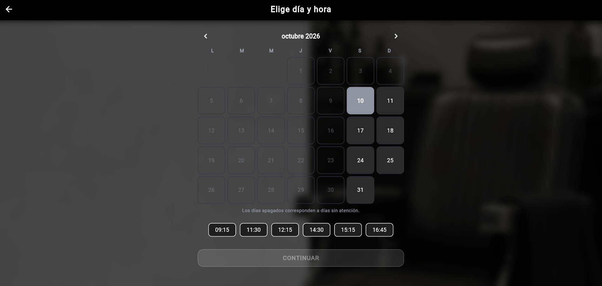
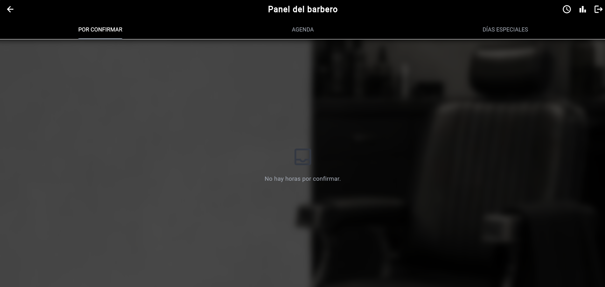
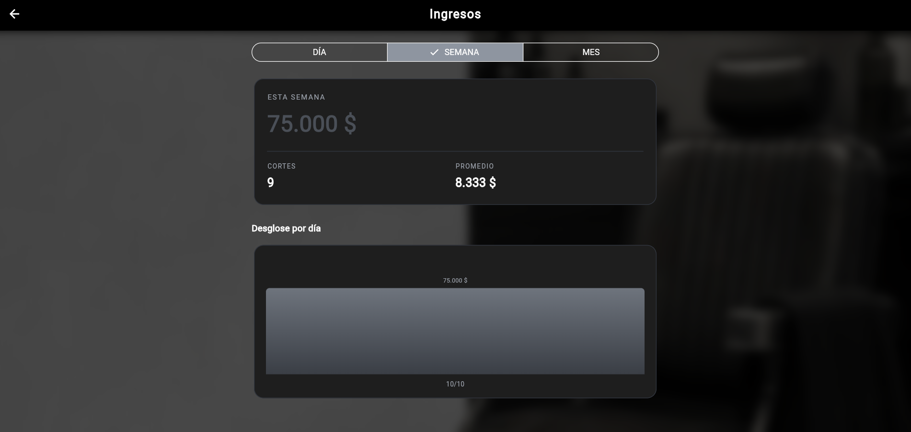

# Barbería Yampi

App web de reservas para una barbería real, con panel de administración
para el barbero y reserva online para los clientes.

**Demo:** https://yampi-barberia.web.app

## Qué hace

- El cliente elige un servicio, un día y una hora disponible, y recibe
  confirmación por correo electrónico
- El barbero administra todo desde un panel: confirmar, rechazar,
  cambiar hora o anular una reserva
- Módulo de ingresos con totales por día, semana y mes, con gráfico
  de desglose diario
- Historial por cliente: cantidad de visitas, última visita, total
  gastado y servicio más pedido
- Cierre de días completos (vacaciones, feriados) y apertura de días
  especiales con horario propio
- Notificaciones automáticas al barbero por cada reserva nueva

## Tecnologías

- **Flutter** (Dart) para la interfaz, compilada a web
- **Firebase Firestore** como base de datos en tiempo real
- **Supabase Edge Functions** para el envío de correos
- **Brevo** como servicio de correo transaccional
- **Firebase Hosting** para el despliegue

## Capturas

## Cómo correrlo localmente

    flutter pub get
    flutter run -d chrome

## Estado

Finalizada, en uso por una barbería real.
